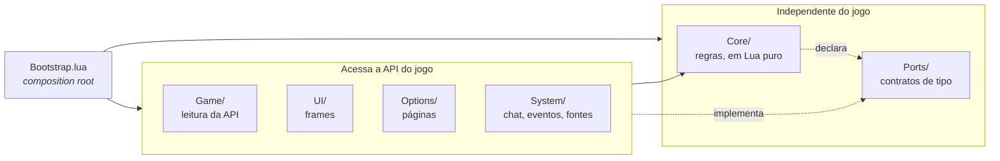
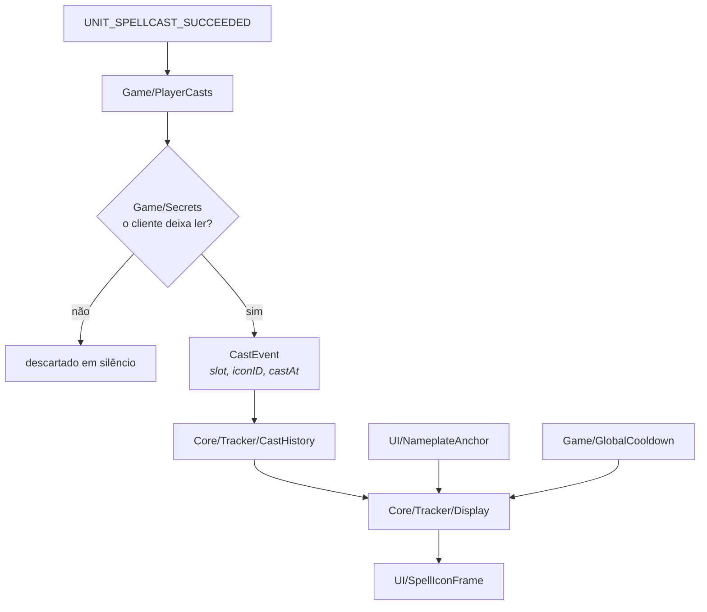

# Arquitetura

## A regra de dependência

**As dependências apontam para dentro.** O `Core/` não referencia nenhuma outra
camada; as camadas externas referenciam o `Core/`. Todas as camadas de código
vivem sob `Source/`; na raiz do addon ficam só o `.toc`, `Bindings.xml` e as
pastas de mídia, locales e bibliotecas.



O `Core/` acessa recursos externos **apenas por objetos injetados**, cujo formato
está descrito em `Ports/`. Não há chamadas a `C_Spell`, `CreateFrame`,
`GetTime` ou `Settings` em nenhum arquivo dele.

A restrição é verificável:

```sh
grep -rlE "C_[A-Za-z]+\.|CreateFrame|Settings\.|LibStub|GetTime|Unit[A-Z]" Source/Core/
```

Se o comando imprimir algum caminho, a regra foi violada.

## Motivação

**Não existe framework de teste dentro do WoW.** Código acoplado à API do jogo só
pode ser verificado abrindo o cliente e inspecionando o resultado manualmente.
Código desacoplado roda em qualquer interpretador Lua.

O `Core/` é coberto por [testes em Lua puro](../Tests/Run.lua) que rodam sem o
cliente, em milissegundos, no CI.

Neste addon a regra paga um segundo dividendo. Quase toda a dificuldade está em
**não tocar em valores que o cliente classificou** — comparar, medir ou usar um
deles como chave derruba a execução na hora. Manter o `Core/` incapaz de chamar a
API significa que ele nunca recebe um valor desses: quem lê o jogo já resolveu
isso antes de passar adiante.

## As pastas

| Pasta | Conteúdo | Acessa a API do jogo |
|---|---|---|
| `Core/` | preferências, histórico de magias, geometria, visibilidade, texto de vida | **não** |
| `Ports/` | contratos de tipo, lidos pelo language server | não é código |
| `Game/` | leitura de magias, recarga, nameplates e valores secretos | sim |
| `System/` | chat, comandos, atalhos, acervo de fontes, funil de eventos | sim |
| `UI/` | o ícone, as linhas de vida, o nome e seu fundo, a âncora, o minimapa | sim |
| `Options/` | as páginas do painel e o kit de controles | sim |

## O caminho de uma magia



O `CastEvent` que cruza a fronteira já é seguro: leva um id de textura resolvido,
nunca o id da magia. Se o cliente classificou qualquer parte do caminho, o
adapter devolve `nil` e nada chega ao `Core/`.

## Os contratos

Cada port em `Source/Ports/` é um arquivo `---@meta`: tipo, nenhum código. O
language server os lê durante a edição, e o empacotador os descarta.

| Port | Quem declara | Quem implementa |
|---|---|---|
| `Logger` | `Core/Commands` | `System/ChatLogger` |
| `CommandRegistry` | Bootstrap | `System/SlashCommandRegistry` |
| `CastSource` | `Core/Tracker` | `Game/PlayerCasts`, `Game/UnitCasts` |
| `CooldownSource` | `Core/Tracker/Display` | `Game/GlobalCooldown` |
| `HealthSource` | `Core/Tracker/HealthDisplay` | `Game/UnitHealth` |
| `TextRendererPool` | `Core/Tracker/HealthDisplay` | `UI/HealthTextPool` |
| `HostSource` | `Core/Tracker/Display` | `UI/NameplateAnchor` |
| `IconRenderer` | `Core/Tracker/Display` | `UI/SpellIconFrame` |
| `TextRenderer` | `Core/Tracker/HealthDisplay` | `UI/HealthTextFrame` |
| `AppearanceSources` | `Core/Tracker/Display` | `System/MediaLibrary`, `Game/ClassColor` |
| `Preference` | `Core/Preferences` | `Options/` |

Duas fontes de magia implementam o mesmo `CastSource`, e é por isso que o
histórico não sabe que uma delas pode emudecer.

## Onde mora cada decisão

| Pergunta | Arquivo |
|---|---|
| Qual foi a última magia, e ela ainda vale? | `Core/Tracker/CastHistory.lua` |
| Onde o ícone se prende, e de que tamanho? | `Core/Tracker/Layout.lua` |
| O ícone aparece agora? | `Core/Tracker/Visibility.lua` |
| O que desenhar, com o que, e em quê? | `Core/Tracker/Display.lua` |
| O que cada linha de vida diz, e em quais placas? | `Core/Tracker/HealthDisplay.lua` |
| Quais unidades estão com nameplate na tela? | `Game/NameplateTracker.lua` |
| O cliente deixa ler este valor? | `Game/Secrets.lua` |
| De qual frame o ícone pendura? | `UI/NameplateAnchor.lua` |
| Quem é quem, concretamente? | `Bootstrap.lua` |
