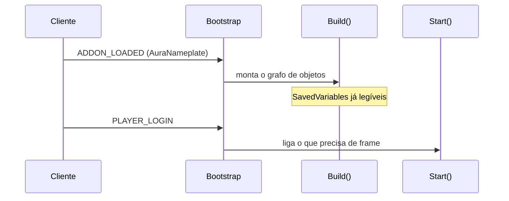
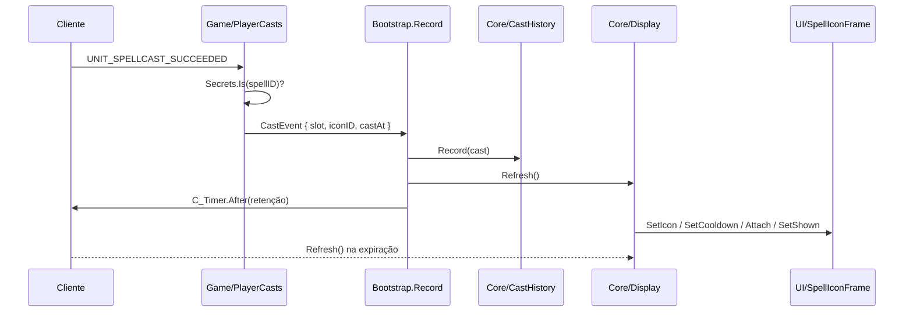

# Fluxo de execução

## Inicialização

Duas etapas, porque as SavedVariables e a interface ficam prontas em momentos
diferentes.

`Build()` é o composition root: resolve o perfil, cria as preferências, o
histórico, as fontes de magia, o display e o painel de opções. `Start()` só faz o
que exige a interface pronta — prende o botão de minimapa, desenha pela primeira
vez e escreve a saudação.

A saudação espera o `PLAYER_LOGIN` porque o quadro de chat restaura o histórico
depois da tela de carregamento e descarta o que foi escrito antes dela.

Um `/reload` não passa por `PLAYER_LOGIN`, então `Build()` verifica
`IsLoggedIn()` e chama `Start()` na hora.

## Uma magia lançada

O ponto sutil está na última linha. **Nada no cliente dispara quando uma magia
já ficou tempo suficiente na tela.** O desenho seria correto e o ícone ficaria
para sempre. Por isso a expiração é agendada no momento da gravação: um
`C_Timer.After` por magia, em vez de um ticker rodando a sessão inteira para os
poucos segundos que importam.

## O funil de eventos

`System/CastEvents.lua` transforma tudo o que pode mudar o desenho num único
sinal:

| Evento | Por que importa |
|---|---|
| `PLAYER_TARGET_CHANGED` | o ícone acompanha o alvo |
| `NAME_PLATE_UNIT_ADDED` | apareceu onde pendurar |
| `NAME_PLATE_UNIT_REMOVED` | sumiu onde pendurar, e o slot da unidade é esquecido |
| `PLAYER_REGEN_ENABLED` / `DISABLED` | o modo "só em combate" depende dos dois |
| `PLAYER_ENTERING_WORLD` | volta de carregamento com o estado já mudado |

Vários chegam juntos numa troca de alvo — a placa antiga sai, a nova entra e o
evento de alvo cai no mesmo quadro. O funil junta a rajada num só `Refresh()`,
com 0,05 s de espera.

## Um desenho

`IconDisplay:Refresh()` é a única função que decide o que aparece:

1. pergunta à `NameplateAnchor` de onde pendurar — a placa do alvo, a posição
   livre, ou nada;
2. pega a magia mais recente entre os slots que valem (sempre o jogador; a
   unidade da placa só se a preferência estiver ligada);
3. passa tudo para `IconVisibility.IsShown`;
4. se for esconder, faz **uma** chamada e para ali. Vestir o ícone antes de saber
   se ele fica rodaria em todo evento que não mudou nada;
5. se for mostrar, resolve ícone, recarga, aparência, fonte e ponto de âncora, e
   manda desenhar.

Nada aqui toca em frame. `Refresh()` roda inteiro fora do jogo, contra tabelas
que só anotam o que receberam — é o que as suítes de `Tests/Core/Tracker/`
fazem.

## Combate

O painel de opções não abre em combate: a Blizzard bloqueia, e insistir gera uma
ação bloqueada em nome do addon. O clique vira um aviso no chat.

O desenho em si continua normalmente. O ícone nunca é reparentado num nameplate
e não escreve em frame protegido, então não há nada a adiar até o fim da luta.
